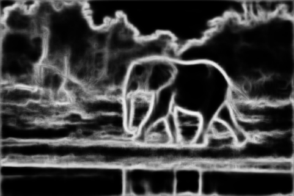
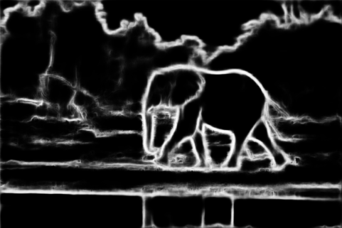
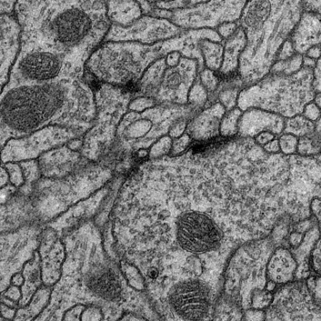
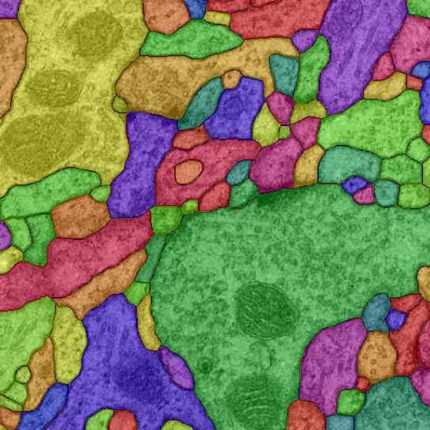

# End-to-end trainable high-order CRF for optimizing multicut edge weights

Solving the Minimum Cost Multicut Problem (MP) [[1]](#1) is a popular way
of obtaining a decomposition of a graph. Heuristics that solve the MP are
usually time-expensive. Reducing the number of violations of the MP cycle
constraints results in a more accurate decomposition and allows for using
an efficient and simple connected component solver. Song et al. [[2]](#2) incorporate cycle
information in an end-to-end trainable Conditional Random Field (CRF).
This thesis extends the higher-order CRF by Song et al. [[2]](#2) by including exponents
that are successively updated using a simulated annealing approach. In
addition, it is combined with the RCF edge detector [[3]](#3) to create an end-to-end 
trainable model for image segmentation. Models trained with the new
CRF produce more certain predictions (i.e. closer to 0 or 1) and less cycle
constraints violations. Experiments on BSDS-500 [[4]](#4) and ISBI [[5]](#5) show
that using the CRF improves edge detection as well as image segmentation
results.

This repository provides the python code (Pytorch) for the RCF-CRF model, files for training
a new model using the VGG or ResNet backbone in the RCF part as well as code for a simple
example of the CRF on MNIST.

## Output Examples

### Edge Detection

Original Image

RCF alone

 
 
RCF optimized with CRF

 

### Image Segmentation

Original Image 

 

Final Segmentation optimized with the CRF

 

## References

<a id="1">[1]</a> 
Sunil Chopra and Mendu R Rao. The partition problem. Mathematical Programming,
59(1-3):87–115, 1993.

<a id="2">[2]</a> 
Jie Song, Bjoern Andres, Michael J Black, Otmar Hilliges, and Siyu Tang.
End-to-end learning for graph decomposition. In Proceedings of the IEEE
International Conference on Computer Vision, pages 10093–10102, 2019.

<a id="3">[3]</a> 
Yun Liu, Ming-Ming Cheng, Xiaowei Hu, Jia-Wang Bian, Le Zhang, Xiang
Bai, and Jinhui Tang. Richer convolutional features for edge detection.
IEEE Transactions on Pattern Analysis and Machine Intelligence (TPAMI),
41(8):1939–1946, 2019.

<a id="4">[4]</a> 
Pablo Arbelaez, Michael Maire, Charless Fowlkes, and Jitendra Malik. Contour
detection and hierarchical image segmentation. IEEE transactions on
pattern analysis and machine intelligence, 33(5):898–916, 2010.

<a id="5">[5]</a> 
Ignacio Arganda-Carreras, Srinivas C Turaga, Daniel R Berger, Dan Cire¸san,
Alessandro Giusti, Luca M Gambardella, Jürgen Schmidhuber, Dmitry
Laptev, Sarvesh Dwivedi, Joachim M Buhmann, et al. Crowdsourcing the
creation of image segmentation algorithms for connectomics. Frontiers in
neuroanatomy, 9:142, 2015.